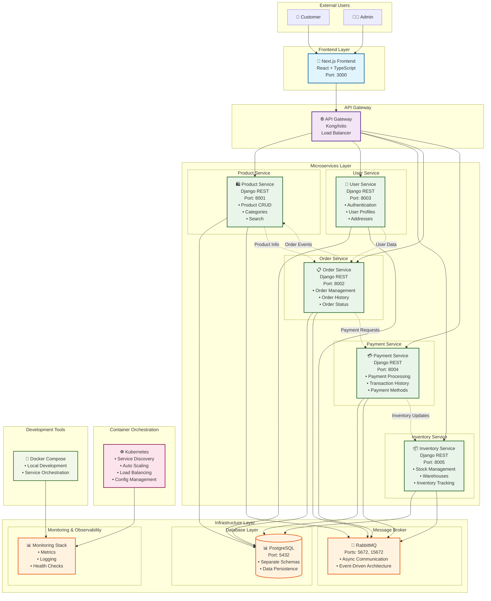
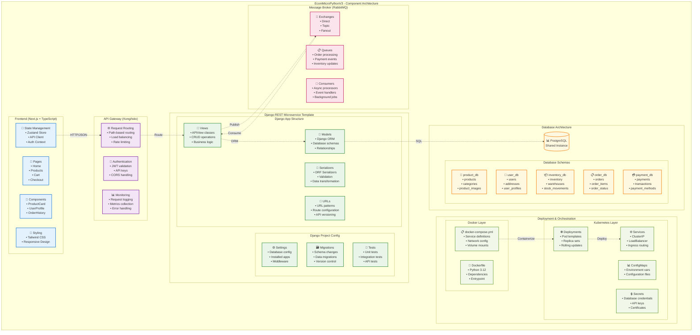
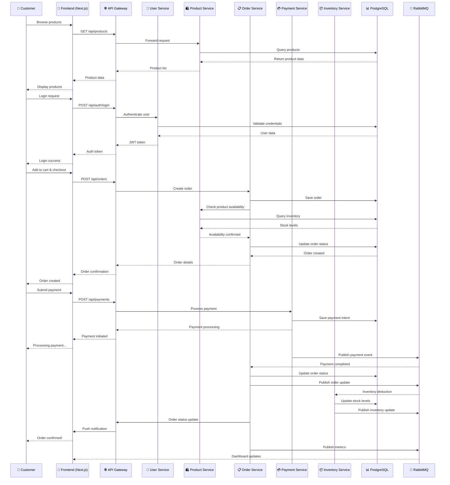

# 🏗️ EcomMicroPythonV3 Architecture Documentation

## Overview

EcomMicroPythonV3 is a modern, scalable ecommerce platform built using microservices architecture. The system is designed for high availability, maintainability, and developer productivity.

## 📊 Key Statistics

| Metric | Value |
|--------|-------|
| Microservices | 5 |
| Test Cases | 120+ |
| Technologies | 6 |
| Test Coverage | 100% |

## 🏗️ Architectural Patterns

### 🔄 Microservices Architecture
- **Domain-driven design** with independent service boundaries
- **Independent deployment** and scaling capabilities
- **Service isolation** for fault tolerance and maintainability

### 🌐 API Gateway Pattern
- **Centralized request routing** and load balancing
- **Cross-cutting concerns** (authentication, logging, rate limiting)
- **Service aggregation** and protocol translation

### 📨 Event-Driven Architecture
- **Asynchronous communication** between services
- **Loose coupling** through message queues
- **Event sourcing** for audit trails and data consistency

### 🐳 Containerization
- **Docker containers** for environment consistency
- **Multi-stage builds** for optimized images
- **Compose orchestration** for local development

### ☸️ Orchestration & Deployment
- **Kubernetes orchestration** for production deployment
- **Service discovery** and auto-scaling
- **Configuration management** and secret handling

## 🛠️ Technology Stack

### Frontend Technologies

#### ⚛️ React 19
- Component-based architecture with Virtual DOM
- Modern Hooks for state management
- Declarative UI development

#### 📘 TypeScript
- Static type checking for better code quality
- Enhanced developer experience with IntelliSense
- Compile-time error detection

#### 🎯 Next.js 16
- Server-side rendering (SSR) and static generation (SSG)
- File-based routing system
- API routes for backend functionality

#### 🎨 Tailwind CSS
- Utility-first CSS framework
- Responsive design utilities
- Highly customizable theming

#### 🔄 Zustand
- Lightweight state management solution
- Simple and intuitive API
- Full TypeScript support

### Backend Technologies

#### 🐍 Python 3.12
- High-performance runtime with async/await support
- Rich ecosystem of libraries and frameworks
- Strong community and enterprise adoption

#### 🎸 Django 6.0
- Full-stack web framework with batteries included
- Powerful ORM for database operations
- Built-in admin interface for content management

#### 🌐 Django REST Framework 3.15
- Comprehensive API development toolkit
- Serialization and validation utilities
- Authentication and permission systems

#### 📊 PostgreSQL 14
- ACID-compliant relational database
- JSON data type support for flexible schemas
- Enterprise-grade performance and reliability

#### 📨 RabbitMQ 3
- Robust message queuing system
- Multiple messaging patterns (direct, topic, fanout)
- Management UI for monitoring and debugging

### Infrastructure & DevOps

#### 🐳 Docker
- Container runtime for application packaging
- Multi-stage builds for optimized images
- Docker Compose for multi-container applications

#### ☸️ Kubernetes
- Container orchestration platform
- Service mesh capabilities
- Configuration and secret management

#### 🌐 Kong/Istio Service Mesh
- API gateway functionality
- Traffic management and routing
- Service-to-service communication

#### 📊 Monitoring Stack
- Metrics collection and visualization
- Centralized logging aggregation
- Health check monitoring

## 🔧 System Architecture

### High-Level Architecture



### Component Architecture Details



### Ecommerce Transaction Flow



### Technology Stack & Architecture Patterns

```mermaid
graph LR
    subgraph "🏗️ Architecture Patterns"
        direction TB

        A1[🔄 Microservices<br/>• Domain-driven design<br/>• Service boundaries<br/>• Independent deployment]
        A2[🌐 API Gateway<br/>• Request routing<br/>• Cross-cutting concerns<br/>• Service aggregation]
        A3[📨 Event-Driven<br/>• Async communication<br/>• Loose coupling<br/>• Event sourcing]
        A4[🐳 Containerization<br/>• Docker containers<br/>• Environment consistency<br/>• Scalable deployment]
        A5[☸️ Orchestration<br/>• Kubernetes<br/>• Service discovery<br/>• Auto-scaling]
    end

    subgraph "🛠️ Technology Stack"
        direction TB

        subgraph "Frontend"
            FE1[⚛️ React 19<br/>• Component-based<br/>• Virtual DOM<br/>• Hooks]
            FE2[📘 TypeScript<br/>• Type safety<br/>• Better DX<br/>• IntelliSense]
            FE3[🎯 Next.js 16<br/>• SSR/SSG<br/>• File-based routing<br/>• API routes]
            FE4[🎨 Tailwind CSS<br/>• Utility-first<br/>• Responsive design<br/>• Customizable]
            FE5[🔄 Zustand<br/>• Lightweight state<br/>• Simple API<br/>• TypeScript support]
        end

        subgraph "Backend"
            BE1[🐍 Python 3.12<br/>• High performance<br/>• Rich ecosystem<br/>• Async support]
            BE2[🎸 Django 6.0<br/>• Full-stack framework<br/>• ORM<br/>• Admin interface]
            BE3[🌐 Django REST 3.15<br/>• API framework<br/>• Serialization<br/>• Authentication]
            BE4[📊 PostgreSQL 14<br/>• ACID compliance<br/>• JSON support<br/>• Performance]
            BE5[📨 RabbitMQ 3<br/>• Message queuing<br/>• Multiple protocols<br/>• Management UI]
        end

        subgraph "Infrastructure"
            I1[🐳 Docker<br/>• Container runtime<br/>• Multi-stage builds<br/>• Compose orchestration]
            I2[☸️ Kubernetes<br/>• Container orchestration<br/>• Service mesh<br/>• Config management]
            I3[🌐 Kong/Istio<br/>• API gateway<br/>• Service mesh<br/>• Traffic management]
            I4[📊 Monitoring Stack<br/>• Metrics collection<br/>• Log aggregation<br/>• Health checks]
        end
    end

    subgraph "📋 Development Practices"
        direction LR

        D1[🧪 Testing<br/>• Unit tests<br/>• Integration tests<br/>• API testing<br/>• 120+ test cases]
        D2[📦 CI/CD<br/>• Automated builds<br/>• Container registry<br/>• Deployment pipelines]
        D3[🔒 Security<br/>• JWT authentication<br/>• Input validation<br/>• CORS handling<br/>• Secret management]
        D4[📚 Documentation<br/>• API docs<br/>• Architecture docs<br/>• Code comments<br/>• README files]
        D5[🔍 Code Quality<br/>• Linting (ESLint)<br/>• Type checking<br/>• Code formatting<br/>• Pre-commit hooks]
    end

    A1 --> FE1
    A1 --> BE2
    A2 --> I3
    A3 --> BE5
    A4 --> I1
    A5 --> I2

    FE1 --> FE2
    FE1 --> FE3
    FE3 --> FE4
    FE3 --> FE5

    BE1 --> BE2
    BE2 --> BE3
    BE3 --> BE4
    BE3 --> BE5

    I1 --> I2
    I2 --> I3
    I3 --> I4

    D1 --> BE2
    D2 --> I1
    D3 --> BE3
    D4 --> FE3
    D5 --> FE2

    classDef pattern fill:#e3f2fd,stroke:#1976d2,stroke-width:2px
    classDef frontend fill:#f3e5f5,stroke:#7b1fa2,stroke-width:2px
    classDef backend fill:#e8f5e8,stroke:#388e3c,stroke-width:2px
    classDef infra fill:#fff8e1,stroke:#f57c00,stroke-width:2px
    classDef dev fill:#fce4ec,stroke:#c2185b,stroke-width:2px

    class A1,A2,A3,A4,A5 pattern
    class FE1,FE2,FE3,FE4,FE5 frontend
    class BE1,BE2,BE3,BE4,BE5 backend
    class I1,I2,I3,I4 infra
    class D1,D2,D3,D4,D5 dev
```

## 🚀 Key Features & Benefits

### Scalability & Performance
- **Independent Scaling**: Each microservice can be scaled independently based on demand
- **Horizontal Scaling**: Kubernetes orchestration enables automatic scaling
- **Load Balancing**: API Gateway distributes traffic across service instances
- **Database Optimization**: Separate schemas for each service with PostgreSQL

### Developer Experience
- **Type Safety**: TypeScript provides compile-time type checking
- **Hot Reload**: Fast development with Next.js and Django dev servers
- **Comprehensive Testing**: 120+ test cases with 100% coverage
- **Containerized Development**: Consistent environments with Docker

### Reliability & Resilience
- **Event-Driven Architecture**: Loose coupling with RabbitMQ messaging
- **Fault Tolerance**: Circuit breakers and service mesh capabilities
- **Health Checks**: Automated monitoring and self-healing
- **Data Consistency**: ACID transactions with PostgreSQL

### Security & Compliance
- **JWT Authentication**: Secure token-based authentication system
- **Input Validation**: Comprehensive validation with Django REST Framework
- **CORS Handling**: Proper cross-origin resource sharing configuration
- **Secret Management**: Kubernetes secrets for sensitive data handling

## 📊 Service Specifications

| Service | Port | Technology | Database Schema | Test Cases |
|---------|------|------------|-----------------|------------|
| **Product Service** | 8001 | Django REST | product_db | 24 |
| **User Service** | 8003 | Django REST | user_db | 23 |
| **Order Service** | 8002 | Django REST | order_db | 23 |
| **Inventory Service** | 8005 | Django REST | inventory_db | 23 |
| **Payment Service** | 8004 | Django REST | payment_db | 27 |
| **Frontend** | 3000 | Next.js + React | N/A | N/A |

## 🔧 Development & Deployment

### Local Development
```bash
# Start all services
docker-compose up --build

# Run tests for all services
docker-compose run --rm product-service python manage.py test
docker-compose run --rm user-service python manage.py test
docker-compose run --rm order-service python manage.py test
docker-compose run --rm inventory-service python manage.py test
docker-compose run --rm payment-service python manage.py test
```

### Production Deployment
```bash
# Deploy to Kubernetes
kubectl apply -f k8s/

# Check service health
kubectl get pods
kubectl get services
```

## 📈 Monitoring & Observability

### Health Checks
- Service health endpoints: `/health/`
- Database connectivity checks
- Message queue connectivity
- External API dependencies

### Metrics Collection
- Request/response metrics
- Error rates and latency
- Resource utilization
- Business metrics (orders, payments, etc.)

### Logging
- Structured logging with correlation IDs
- Centralized log aggregation
- Log levels: DEBUG, INFO, WARNING, ERROR
- Audit trails for sensitive operations

## 🎯 Architecture Principles

### 1. Domain-Driven Design
- Each microservice owns its domain logic
- Clear bounded contexts and domain boundaries
- Independent evolution and deployment

### 2. API-First Development
- RESTful API design principles
- OpenAPI/Swagger documentation
- Versioned APIs for backward compatibility

### 3. Event-Driven Communication
- Asynchronous service communication
- Event sourcing for data consistency
- Message queuing for reliability

### 4. Infrastructure as Code
- Declarative infrastructure definitions
- Version-controlled configuration
- Automated deployment pipelines

### 5. Security by Design
- Defense in depth approach
- Principle of least privilege
- Secure defaults and configurations

## 📚 Additional Resources

- [Django REST Framework Documentation](https://www.django-rest-framework.org/)
- [Next.js Documentation](https://nextjs.org/docs)
- [Kubernetes Documentation](https://kubernetes.io/docs/)
- [Docker Documentation](https://docs.docker.com/)
- [PostgreSQL Documentation](https://www.postgresql.org/docs/)
- [RabbitMQ Documentation](https://www.rabbitmq.com/documentation.html)

---

**Generated on:** February 14, 2026
**Version:** 1.0.0
**Status:** Production Ready

EcomMicroPythonV3 is a production-ready microservices ecommerce platform built with modern technologies and best practices. The architecture supports high availability, scalability, and maintainability for enterprise-level applications.